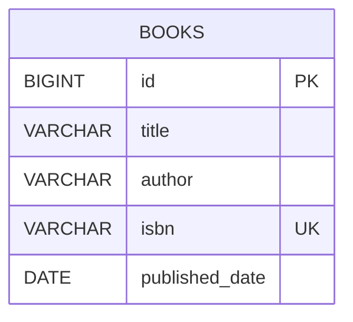

# Book Management Microservice

Spring Boot REST service with full CRUD for books, backed by PostgreSQL.

**Stack:** Java 21, Spring Boot 4.1 (Maven), Spring Data JPA, PostgreSQL, Bean Validation.

## Prerequisites
- JDK 21+
- Maven 3.9+ (or use your IDE)
- PostgreSQL 14+ (or Docker)

## Run

1. Start PostgreSQL (easiest via Docker):
   ```bash
   docker compose up -d
   ```
   Or create the database manually: `CREATE DATABASE bookdb;`
2. Start the app:
   ```bash
   mvn spring-boot:run
   ```
   The API is available at `http://localhost:8080`. The `books` table is created automatically.
3. Run tests: `mvn test`

## Environment variables

| Variable      | Default                                   | Description               |
|---------------|-------------------------------------------|---------------------------|
| `DB_URL`      | `jdbc:postgresql://localhost:5432/bookdb` | JDBC URL                  |
| `DB_USERNAME` | `postgres`                                | Database user             |
| `DB_PASSWORD` | `postgres`                                | Database password         |
| `SERVER_PORT` | `8080`                                    | HTTP port                 |
| `DDL_AUTO`    | `update`                                  | Hibernate schema strategy |

## API

| Method | Endpoint          | Description                           | Success |
|--------|-------------------|---------------------------------------|---------|
| POST   | `/api/books`      | Add a new book                        | 201     |
| GET    | `/api/books`      | Get all books                         | 200     |
| GET    | `/api/books/{id}` | Get a book by ID                      | 200     |
| PUT    | `/api/books/{id}` | Full update (all fields required)     | 200     |
| PATCH  | `/api/books/{id}` | Partial update (any subset of fields) | 200     |
| DELETE | `/api/books/{id}` | Delete a book                         | 204     |

Errors: `400` validation/malformed body, `404` book not found, `409` duplicate ISBN.
`publishedDate` format is `yyyy-MM-dd`.

### Sample requests
```bash
curl -X POST http://localhost:8080/api/books \
  -H "Content-Type: application/json" \
  -d '{"title":"Clean Code","author":"Robert C. Martin","isbn":"9780132350884","publishedDate":"2008-08-01"}'

curl -X PATCH http://localhost:8080/api/books/1 \
  -H "Content-Type: application/json" -d '{"title":"Clean Code (2nd copy)"}'
```

## Postman
Import [`postman/book-management.postman_collection.json`](postman/book-management.postman_collection.json).
It uses `baseUrl` and `bookId` collection variables; the create request stores the new `id` automatically.

## ER Diagram
Also in [`docs/ER-diagram.md`](docs/ER-diagram.md).



## Project structure
```
controller/  REST endpoints
service/     business logic and transactions
repository/  Spring Data JPA
model/       JPA entity
dto/         request/response records + validation
exception/   custom exceptions and global handler
```
