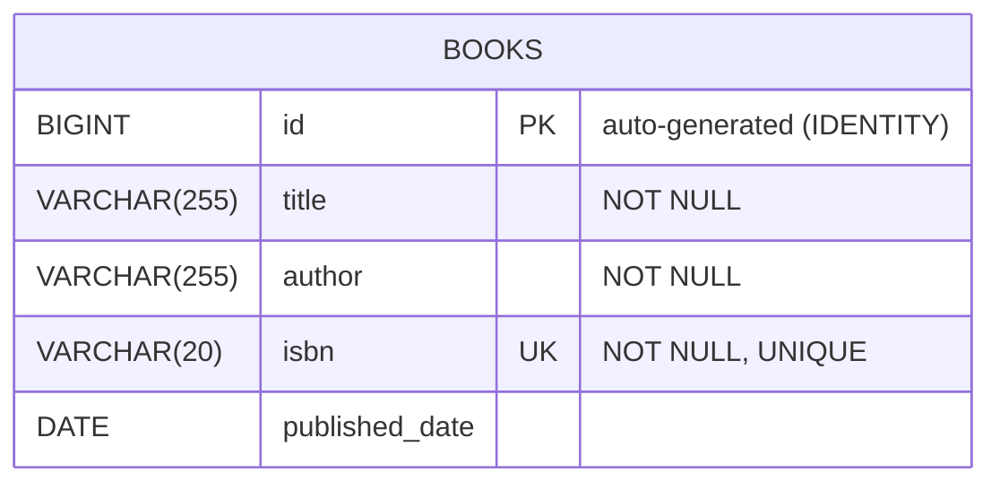

# ER Diagram

The service has a single entity, `books`.

```mermaid
erDiagram
    BOOKS {
        BIGINT id PK "auto-generated (IDENTITY)"
        VARCHAR(255) title "NOT NULL"
        VARCHAR(255) author "NOT NULL"
        VARCHAR(20) isbn UK "NOT NULL, UNIQUE"
        DATE published_date
    }
```
